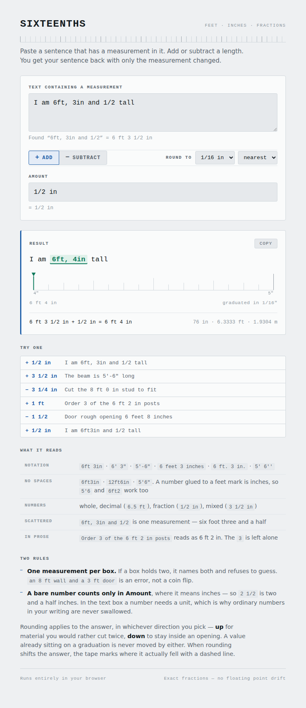
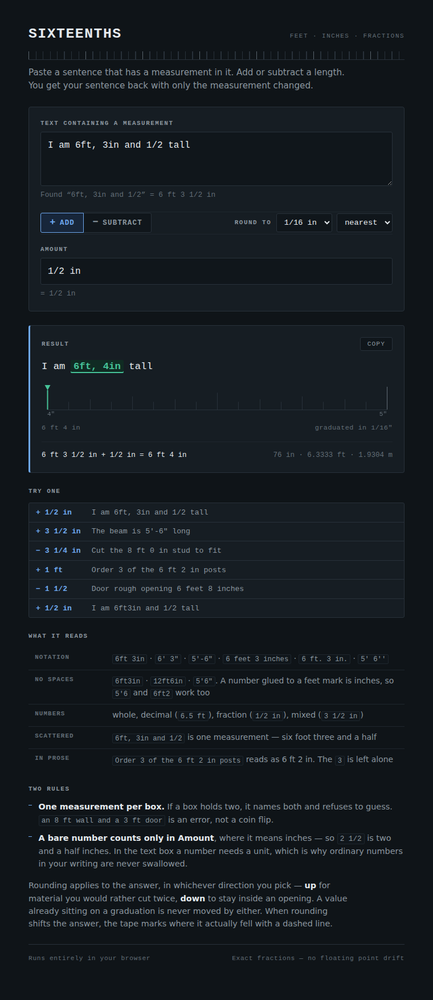

# Sixteenths — a feet &amp; inches calculator

Paste any text that contains a feet-and-inches measurement, give it a length to add
or subtract, and get your text back with only the measurement changed.

**→ [Open the calculator](https://llpamies.github.io/construction_calc/)**



<details>
<summary>Dark theme</summary>



</details>

```
I am 6ft, 3in and 1/2 tall     + 1/2 in    →    I am 6ft, 4in tall
The beam is 5'-6" long         + 3 1/2 in  →    The beam is 5'-9 1/2" long
Cut the 8 ft 0 in stud to fit  − 3 1/4 in  →    Cut the 7 ft 8 3/4 in stud to fit
```

## Why

Most feet-and-inch calculators make you disassemble your measurement into separate
feet / inches / numerator / denominator boxes, then hand you back a number you have
to retype into whatever you were actually writing. This one takes the sentence you
already have and edits it in place.

## What it understands

| | |
|---|---|
| Notations | `6ft 3in`, `6' 3"`, `5'-6"`, `6 feet 3 inches`, `6 ft. 3 in.`, `5’ 6”`, `5' 6''` |
| Without spaces | `6ft3in`, `12ft6in`, `5'6"` — and a number glued to a feet mark is inches, so `5'6` and `6ft2` work too |
| Numbers | integers, decimals (`6.5 ft`, `.5 in`), fractions (`1/2 in`), mixed (`3 1/2 in`) |
| Scattered parts | `6ft, 3in and 1/2` reads as one measurement of 6&nbsp;ft&nbsp;3½&nbsp;in |
| Surrounding prose | `Order 3 of the 6 ft 2 in posts` reads as 6&nbsp;ft&nbsp;2&nbsp;in — the `3` is left alone |

Two rules keep it honest:

- **Exactly one measurement per box.** If a box holds more than one, the app names
  both and refuses to guess. `an 8 ft wall and a 3 ft door` is an error, not a
  coin flip.
- **A bare number only counts in the Amount box**, where it means inches. In the
  text box a number needs a unit before it is treated as a measurement, so ordinary
  numbers in your prose are never swallowed.

Your notation is echoed back: feed it `5'-6"` and the answer is `5'-9 1/2"`, not
`5 ft 9.5 in`. The tick marks, the spacing, the separator, and whether you used feet
at all are all preserved.

## Rounding

Answers snap to a fraction you pick, from ½" down to ¹⁄₆₄", in one of three
directions:

| | |
|---|---|
| **nearest** (default) | closest graduation; halves go away from zero |
| **up** | always toward a longer measurement — material you would rather cut twice |
| **down** | always toward a shorter one — to stay inside an opening |

A value already sitting on a graduation is never moved, in any direction. Direction
is signed, so on a negative result *up* still means toward a longer measurement.

The snapping is done in integer arithmetic rather than by dividing first. A value
that should land exactly on a graduation would otherwise compute as `7.999999999`,
and rounding down would drop it a whole tick.

Only the answer is rounded. The two readouts show what you actually typed, rendered
at its own denominator — enter `1/3` and it says `1/3 in`, not a distorted `5/16 in`
— and the answer is marked `≈` when rounding moved it.

## The tape

Under each answer is a zoom into the single inch the result lands in, drawn on a
canvas and subdivided at whatever precision you have selected — pick 1/64 and the
graduations genuinely get finer. It turns an abstract dropdown into something you
can see, and reads the way a rule does, with tick heights stepping down by halving.

When rounding moves the answer, a dashed line marks where the unrounded value
actually fell, so you can see exactly what the direction cost you.

## Running it

It is four static files and no dependencies — no build step, no bundler, no
framework. Open `index.html` directly, or serve the folder:

```sh
python3 -m http.server
```

## Tests

```sh
node test/lengths.test.js                                          # 78 parser tests
NODE_PATH=/path/to/global/node_modules node test/browser.smoke.js  # page, needs playwright
```

`lengths.js` is loadable both as a browser script and as a Node module, so the same
code backs the page and the tests. The browser test re-runs the engine's expectations
inside the page, exercises the UI, and checks that both light and dark themes resolve
with the body painting its own ground.

## How it works

`lengths.js` is the whole engine, in three stages:

1. **Tokenize** — scan for `number + optional unit`, where a number may be an
   integer, decimal, fraction, or mixed number.
2. **Group** — merge adjacent tokens into one measurement when only separators sit
   between them (`, `, ` and `, `-`, `. `). Anything else ends the measurement, which
   is what makes `an 8 ft wall and a 3 ft door` two measurements rather than one.
   A unitless token joins its neighbour only if it is a bare fraction, which is how
   `3in and 1/2` works without `Order 3 of the...` breaking — or if it is glued to a
   feet mark with no space at all, which is how `5'6` reads as 5 ft 6 in while
   `the 6 ft 2 boards` leaves the `2` alone.
3. **Format** — render the result using the marks and spacing captured from the
   input.

Measurements are held as exact rational numbers of inches rather than floats, so
sixteenths stay sixteenths no matter how many edits you stack up.

## License

MIT
